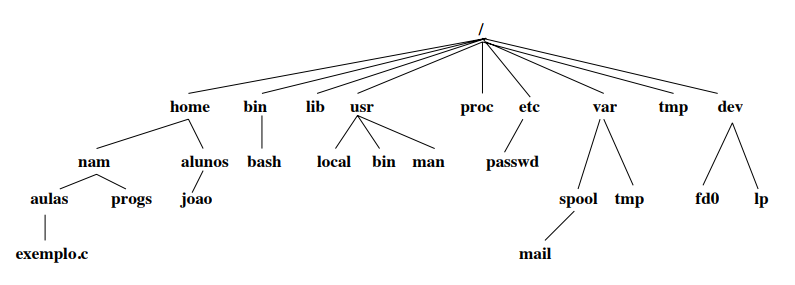

# Sobre Linux

## Linux?

---

> Sabem o que é Linux?

---

> Já usaram o linux?

## Distribuições Linux

---

{width=100% height=100%}

## Let's go!
 
> Instalando Lubuntu (32 bits)

# Linux

## Estrutura do linux

---

{width=100% height=100%}

---

* `/` **Hierarquia primária.**
* `/bin/` **Binários principais dos usuários.**
* `/boot/` **Arquivos do sistema de Boot.**
* `/dev/` **Arquivos de dispositivos.**
* `/etc/` **Arquivos de configuração do sistema.**
* `/home/` **Diretório dos usuários comuns do sistema.**
* `/lib/` **Bibliotecas essenciais do sistema e os módulos do kernel.**
* `/media/` **Diretório de montagem e dispositivos.**

---

* `/mnt/` **Diretório de montagem de dispositivos - mesmo que "media".**
* `/opt/` **Instalação de programas não oficiais da distribuição ou por conta do usuário.**
* `/proc/` **Diretório virtual controlado pelo Kernel com configuração total do sistema.**
* `/root/` **Diretório do usuário root - O usuário root tem o total poder sobre o sistema. Podendo instalar, desinstalar e configurar.**

---

* `/sbin/` **Armazena arquivos executáveis que representam comandos administrativos. Exemplo: shutdown.**
* `/srv/` **Diretório para dados de serviços fornecidos pelo sistema.**
* `/tmp/` **Diretório para arquivos temporários.**
* `/usr/` **Segunda hierarquia do sistema, onde ficam os usuários comuns do sistema e programas.**
* `/var/` **Diretório com arquivos variáveis gerados pelos programas do sistema. Exemplo: logs, spool de impressoras, e-mail e cache.**

# Sobre Shell 

## Shell?

---

O shell é o "prompt" da linha de comando do Unix e Linux, é o servo que recebe os
comandos digitados pelo usuário e os executa.

---

O shell é aquele que aparece logo após digitar-se o nome do usuário e senha e entrar na tela preta.

```sh
hostname login: user  
Password:
Last login: Fri Apr 16 01:57:28 on tty5
[user@hostname ~]$ _
```

## Tipos de Shell

---

> Alguns exemplos de shell

| Command | Nome         | Path        |
|:-------:|:------------:|:-----------:|
| `sh`    | Bourne Shell | `/bin/sh`   |
| `bash`  | Bash         | `/bin/bash` |
| `ksh`   | Korn Shell   | `/bin/ksh`  |
| `zsh`   | Z Shell      | `/bin/zsh`  |

---

> Usuário Logado

| Command | Prompt default (user)       |
|:-------:|:---------------------------:|
| `sh`    | `$`                         |
| `bash`  | `<user>@<hostname>:<path>$` |
| `ksh`   | `$`                         |
| `zsh`   | `<user>@<hostname>:<path>%` |

---

> Super Usuário Logado

| Command | Prompt default (root)       |
|:-------:|:---------------------------:|
| `sh`    | `#`                         |
| `bash`  | `<user>@<hostname>:<path>#` |
| `ksh`   | `#`                         |
| `zsh`   | `<user>@<hostname>:<path>#` |

# Comandos do Shell

## Super Usuário

```bash
user@hostname ~ $ su
senha:
root@hostname user # 
```

## Comandos Úteis  

---

O comando `cd` é usado para acessar e mudar de diretório corrente. Muito utilizado para a navegação entre as pastas.

```bash
$ cd
```

---

Copia o arquivo, tal como o `CTRL+C`. Facilita muito para quem precisa abrir e fechar arquivos ou copiá-los para outra tela.

```bash
$ cp
```

---

Mostra arquivos que estão na pasta em que o usuário está naquele momento. 
Há variações, como exemplo `ls -l`, que obtem informações mais detalhadas dos arquivos.

```bash
$ ls
```

---

Serve para criar diretórios. Geralmente na pasta onde o usuário está utilizando.

```bash
$ mkdir
```

---

Move os arquivos de um local para outro. Também utilizado para renomear arquivos.

```bash
$ mv
```

---

Mostra a pasta atual que o usuário está no momento, auxilia no momento de salvar ou criar novos arquivos.

```bash
$ pwd
```

---

Serve para remover arquivos. Use com cuidado, pois caso remova um documento será irreversível.

```bash
$ rm
```

---

Serve para remover diretórios vazios. Existe a variação `rm`: `rm –r`, da qual é possível remover diretório que não estejam vazios.

```bash
$ rmdir
```

---

Mostra o que tem dentro do arquivo. Funciona para exibir ou ler um documento.

```bash
$ cat
```

---

Serve para informar qual é o tipo de arquivo digitado como parâmetro (texto, imagem, etc)

```bash
$ file
```

---

Mostra a quantidade de linhas, palavras e caracteres de um arquivo.

```bash
$ wc
```

# Controle e Acesso

---

Terminar a sessão do shell

```bash
$ exit
```

---

Mudar a senha do Usuário ou Super Usuário

```bash
$ passwd
Changing password for user.
Current password: 
New password: 
Retype new password: 
passwd: password updated successfully
```

# Ajuda e Documentação

---

Localiza comandos por pesquisa de palavra-chave.

```bash
$ apropos mkdir
mkdir (1)            - make directories
mkdir (1p)           - make directories
mkdir (2)            - create a directory
mkdir (3p)           - make a directory relative to directory file descriptor
mkdirat (2)          - create a directory
```

---

Localizar arquivos.

```bash
$ find
$ find . -name *.txt -print
$ find . -name *.txt
$ find . -type f
$ find . -type d
```

---

Lança o explorador de informações.

```bash
$ info find
```

Para sair do man pressione o tecla "q".

---

Manual nos mostra função de determinado comando.
Muito útil para iniciantes, já que mostra o que faz cada tipo.

```bash
$ man find
```

Para sair do man pressione o tecla "q".

---

Descreve o que um determinado comando.

```bash
$ whatis find
```

---

Localizar a página de ajuda (man page), código fonte, ou ficheiros binários, de um determinado programa.

```bash
$ whereis find
```

# Gestão de Arquivos e Diretórios

---

Mudar de diretório

```bash
$ cd
$ cd pasta
$ cd caminho/pasta
$ cd ..
$ cd /
$ cd ~
$ cd -
```

---

Lista o conteúdo de uma diretório, semelhante ao comando dir no MS-DOS

```bash
$ ls
$ ls -l
$ ls -lh
$ ls -a
$ ls -la
$ ls -lah
$ ls -1
$ ls -1s
```

---

|type           | char | user | group | owner |
|:-------------:|:----:|:----:|:-----:|:-----:|
| file          | -    | rwx  | rwx   | rwx   |
| directory     | d    | rwx  | rwx   | rwx   |
| symbolic link | l    | rwx  | rwx   | rwx   |

---

Mudar a proteção de um arquivo ou diretório, como por exemplo `chmod 777`, parecido com o attrib do MS-DOS

```bash
$ chmod u=rwx,g=rx,o=r arquivo1.txt 
$ chmod 777 arquivo2.txt
```

---

* `4` stands for "read"
* `2` stands for "write"
* `1` stands for "execute"
* `0` stands for "no permission"

> `4 + 2 + 1 + 0 = 7` 

> rwx

---

Mudar o dono ou grupo de um arquivo ou diretório, vem de change owner

```bash
# chown owner:group projeto
$ sudo chown owner:group projeto
```

---

Mudar o grupo de um arquivo ou diretório

```bash
# chgrp group arq.txt
$ sudo chgrp group arq.txt
```

---

Selecciona ou rejeita linhas comuns a dois arquivos seleccionados

```bash
$ comm arq1.txt arq2.txt
```

---

Copia arquivos, como o copy do MS-DOS

```bash
$ cp arq1.txt caminho/
```

---

Compara o conteúdo de dois arquivos ASCII

```bash
$ diff arquivo1.txt arquivo2.txt
```

---

Determina o tipo

```bash
$ file arquivo.txt 
$ file image.png
```

---

Procura em um arquivo por um padrão, sendo um filtro muito útil e usado, por exemplo `cat a.txt | grep ola` irá mostrar-nos apenas as linhas do ficheiro a.txt que contenham a palavra "ola"

```bash
$ grep "trecho a procurar" arquivo.txt 
$ grep "pesquisar" arquivo1.txt arquivo2.txt
```

---

Cria um link, ou atalho conhecido no MS-DOS

```bash
$ ln arqv.txt arq 
$ ln -s arqv.txt arq
$ ln -s pasta pst  
```

---

Cria um diretório, vem de make directory”

```bash
$ mkdir nome_dir 
```

---

Move e ou renomeia arquivos ou diretórios

```bash
$ mv arqv.txt caminho/
$ mv arqv.txt caminho/outro_nome.txt
$ mv arqv.txt outro_nome.txt
```

---

Mostra-nos o caminho por inteiro da diretório em que nos encontramos em dado momento.

```bash
$ pwd
```

---

Apaga ficheiros, vem de remove, e é semelhante ao comando del no MS-DOS. 

```bash
$ rm arq.txt  
$ rm arq1.txt arq2.txt
$ rm -r pasta
```

É preciso ter cuidado com o comando `rm *`, pois apaga tudo sem confirmação por defeito em alguns shells

---

Apaga directórios, vem de remove directory

```bash
$ rmdir dir_void
```

---

Mostra o estado de um arquivo, útil para saber por exemplo a hora e data do último acesso ao mesmo

```bash
$ stat arquivo.txt 
```

---

Faz um flush aos buffers do sistema de arquivos, sincroniza os dados no disco com a memória, ou seja escreve todos os dados presentes nos buffers da memória para o disco

```bash
$ sync
```

---

Ordena, une ou compara texto, podendo ser usado para extrair informações dos ficheiros de texto ou mesmo para ordenar dados de outros comandos como por exemplo listar arquivos ordenados pelo nome

```bash
$ sort
```

---

Cria ou extrai arquivos, muito usado como programa de backup ou compressão de arquivos

```bash
$ tar -cf arq.tar ola_mundo.py
$ tar -cf arq.tar meudir/
```

```bash
$ tar -xvf arq.tar
```

---

Copia o input para um standard output e outros ficheiros

```bash
$ tee
```

---

Traduz caracteres

```bash
$ tr
```

---

Muda as proteções dos arquivos por defeito

```bash
$ umask
```

---

Reporta ou apaga linhas repetidas num arquivo 

```bash
$ uniq
```

---

Conta linhas, palavras e mesmo caracteres num arquivo 

```bash
$ wc
```

# Exibição ou Impressão de Ficheiros

---

Mostra o conteúdo de um ficheiro, como o comando type do MD-DOS, e é muito usado também para concatenar ficheiros, como por exemplo fazendo cat a.txt b.txt > c.txt” para juntar o ficheiro a.txt e b.txt num único de nome c.txt

```bash
$ cat
```

---

Encurta, ou seja, faz um fold das linhas longas para caberem no dispositivo de output

```bash
$ fold
```

---

Mostra as primeiras linhas de um ficheiro, como por exemplo com head -10 a.txt, ou usado como filtro para mostrar apenas os primeiros x resultados de outro comando

```bash
$ head
```

---

Mostra o conteúdo de um ficheiro, mas apenas um ecrã de cada vez, ou mesmo output de outros comandos, como por exemplo ls | more

```bash
$ more
```

---

Funciona como o more, mas com menos features, menos características e potenciais usos

```bash
$ less
```

---

Funciona de forma inversa ao comando head, mostra-nos as últimas linhas de um ficheiro ou mesmo do output de outro comando, quando usado como filtro

```bash
$ tail
```

---

Limpa a tela do terminal

```bash
$ clear
```

Funciona usando o `Ctrl+l`

# Comandos de Notícias ou Rede

---

Mostra o estado da rede

```bash
$ netstat
```

---

Visualizar os ips da nossa máquina, entre outras funções relacionadas com ips

```bash
$ ifconfig
```

---

Pingar um determinado host, ou seja, enviar pacotes icmp para um determinado host e medir tempos de resposta, entre outras coisas

```bash
$ ping
```

# Controlo de Processos

---

Permite-nos visualizar jobs em execução, quando corremos uma aplicação em background, poderemos ver esse job com este comando, e termina-lo com um comando kill -9 %1, se for o job número 1, por exemplo

```bash
$ jobs
```

`Ctrl-z` Suspende o processo

---

Ao contrário do comando bg, o fg traz de volta um processo ao foreground

```bash
$ fg
```

---

Coloca um processo suspenso em background

```bash
$ bg
```

---

Mata um processo, como por exemplo kill -kill 100 ou kill -9 100 ou kill -9 %1

```bash
$ kill
```


# Informação de Estado

---

Exibe o monitoramento do sistema operacional 

```bash
$ top 
```

---

Mostra o calendário do mês corrente

```bash
$ cal
```

---

Exibe a data e hora

```bash
$ date
```

---

Exibe um resumo do espaço livre em disco

```bash
$ df
$ df -h
```

---

Exibe um resumo da memória 

```bash
$ free 
$ free -h
```

---

Exibe um resumo do uso do espaço em disco

```bash
$ du
$ du -h
$ du -sh
$ du -s
```

---

Exibe as variáveis de ambiente

```bash
$ env
```

---

Lista os últimos comandos usados, muito útil para lembrar também de que comandos foram usados para fazer determinada acção no passado ou o que foi feito em dada altura

```bash
$ history
```

---

Indica o último login de utilizadores

```bash
$ last
```

---

Mostra a path de procura para as páginas do comando man

```bash
$ manpath
/usr/local/man:/usr/local/share/man:/usr/share/man
```

---

Imprime as variáveis de ambiente

```bash
$ printenv
```

---

Lista a lista de processos em execução, útil para saber o pid de um processo para o mandar abaixo com o comando kill, entre outras coisas

```bash
$ ps
```

---

Mostra-nos o caminho por inteiro da directoria em que nos encontramos em dado momento, ou seja a pathname

```bash
$ pwd
/home/user
```

---

Define variáveis da sessão

```bash
$ set
$ man set
```

---

Mede o tempo de execução de programas

```bash
$ time
shell  1.23s user 0.38s system 0% cpu 1:12:30.44 total
children  4.43s user 2.09s system 0% cpu 1:12:30.44 total
```

---

Diz-nos há quanto tempo o sistema está funcional, quando foi ligado e o seu uptime

```bash
$ uptime
15:37:08 up  5:22,  1 user,  load average: 0.00, 0.01, 0.00
$ uptime -p    
up 5 hours, 22 minutes
$ uptime -s
2017-10-29 10:14:55
```

---

Mostra-nos quem está no sistema ou que comando cada job está a executar

```bash
$ w
USER     TTY        LOGIN@   IDLE   JCPU   PCPU WHAT
iury     tty2      15:33    3.00s  0.17s  0.17s -sh
```

---

Mostra os usuários logados no sistema naquele momento.

```bash
$ who
iury     tty2         2017-10-29 15:33
```

---

Mostra o nome do usuário que está logado no shell.

```bash
$ whoami
user
```

```bash
# whoami
root
```

# Processamento de Texto

---

Reverte colunas em linhas feeds

```bash
$ man col
```

```bash
$ ls
$ ls | col
```

---

Reverte linhas feeds em colunas

```bash
$ ls | col | xargs
```

---

Diferenças entre arquivos 

```bash
$ diff aula-2.md aula-3.md
1c1
< aula-2
---
> aula-3
```

# Edição de Texto

## Editor de texto full-screen

## `nano`

---

Open or create the file "test.sh".

```bash
$ nano test.py
```

---

File Control in nano

* `Ctrl-o Y Enter` Save changes.
* `Ctrl-r Alt-f`   Open a new file with a new buffer within nano.
* `Alt->`          Switch to the next file buffer in nano.
* `Alt-<`          Switch to the previous file buffer in nano.
* `Ctrl-x`         Quit nano.

---

Navigating through file contents in nano

* `Ctrl-a`      Move to the beginning of the current line.
* `Ctrl-e`      Move to the end of the current line.
* `Ctrl-v`      Move down one page.
* `Ctrl-y`      Move up one page.
* `Alt-\ `      Go to the beginning of the file.
* `Alt-/`       Go to the end of the file.
* `Alt-g`       Go to a target line number.
* `Alt-]`       Jump to matching open/close symbol.
* `Alt-a Alt-}` Select a block and indent the block.
* `Alt-a Alt-{` Select a block and outden the block.

---

Copy and Paste in nano

* `Alt-a`        To select a block for copy or cut operation, do Alt-a again to unselect.
* `Alt-a Alt-^`  Copy a highlighted block to the clipboard.
* `Alt-a Ctrl-k` Cut a highlighted block to the clipboard.
* `Ctrl-k`       Cut from the current cursor position to the end of the current line.
* `Ctrl-u`       Paste the contents from the clipboard at the current cursor position.

---

Search and Replace in nano

* `Ctrl-w` Search for a target string.
* `Alt-w`  Repeat the last search.
* `Alt-r`  Search and replace.

## `sed`

---

Editor de texto stream-oriented

```bash
$ man sed
```

---

```bash
$ echo "palavra1 palavra2 palavra3" | sed -r 's/palavra/NULL/'
NULL1 palavra2 palavra3
$ echo "palavra1 palavra2 palavra3" | sed -r 's/palavra/NULL/g'
NULL1 NULL2 NULL3
```

---

```bash
$ echo "palavra1 palavra2 palavra3" | sed -r 's/([a-zA-Z0-9]+)/NULL/g'
NULL NULL NULL
$ echo "palavra1 palavra2 palavra3" | sed -r 's/([a-zA-Z0-9]+)/NULL/2g'
palavra1 NULL NULL
```

## `vi`

---

Editor de texto full-screen

```bash
$ vi test.sh
```

---

```
    ^
    k
< h   l >
    j
    v
```

---

* `i` modo insert
* `Esc` ou `Ctrl+[` modo normal
* `x` Apaga um caracter 
* `r` Substitui caracter 

# MS-DOS vs LINUX/UNIX 

---

| MS-DOS      | Linux/UNIX  |
|:-----------:|:-----------:|
| attrib      | chmod       |
| backup      | tar         |
| cd          | cd          |
| date        | date        |
| dir         | ls          |
| cls         | clear       |
| copy        | cp          |
| del         | rm          |

---

| MS-DOS      | Linux/UNIX  |
|:-----------:|:-----------:|
| deltree     | rm -R       |
| edit        | vi/nano     |
| exit        | exit        |
| format      | fdformat    |
| ipconfig    | ifconfig    |
| mkdir/md    | mkdir       |
| more < file | more file   |
| move        | rename/mv   |

---

| MS-DOS      | Linux/UNIX  |
|:-----------:|:-----------:|
| netstat     | netstat     |
| ping        | ping        |
| rmdir       | rmdir       |
| time        | time        |
| tracert     | traceroute  |
| type        | cat/less    |
| win         | startx      |

# Shell Script

## Primeiro Script

---

Crie o arquivo `ola.sh`

```bash
#!/bin/bash

echo "olá $USER"
pwd
date
```

Use `vi` ou `nano`

---

```bash
$ cat ola.sh
```

```bash
$ ola.sh
bash: command not found: ola.sh
```

```bash
$ ./ola.sh 
bash: permission denied: ./ola.sh 
```

---

Sem atribuição de execução

```bash
$ ls -l
-rw-r--r-- 1 user users       0 Nov  1 16:13 ola.sh
```

---

Atribui permissão de execução

```bash
$ chmod +x ola.sh
```

ou

```bash
$ chmod 744 ola.sh
```

---

Verifica atribuição 

```bash
$ ls -l
-rwxr--r-- 1 user users       0 Nov  1 16:13 ola.sh
```

---

Execute

```bash
$ ./ola.sh
```

---

Remove atribuição da permissão de execução

```bash
$ chmod -x ola.sh
```

ou

```bash
$ chmod 644 ola.sh
```

---

Execute

```bash
$ ls -l
$ source ola.sh
```

## Variáveis 

---

> `<nome_variável>=<valor>`

* Não são permitidos espaços antes nem depois do carácter `=`
* Apenas caracteres alfanuméricos podem ser utilizados como identificadores válidos de variáveis.

---

Os valores do tipo string que contenham espaços devem ser especificados entre aspas como no exemplo em baixo.

```bash
#!/bin/bash
var1=123
var2=Ola
var_ia_vel="Ola Mundo"
```

---

Variáveis de ambiente

```bash
#!/bin/bash

echo $USER $HOME
echo $PATH
```

Ver todas as variáveis do ambiente com o comando `env`

```bash
$ source var_ambiente.sh
```

---

Variáveis locais

```bash
#!/bin/bash

ola="bom dia"
echo "$ola Paulo"
echo "$olaPaulo" #Texto Pegado a variavel .. não funcione..
echo "${ola}Paulo" #proteger a variável com as chavetas..ok
mesg="$ola $USER"
echo $mesg
```

```bash
$ source var_local.sh
```

---

Input usando `read`

```bash
#!/bin/bash

echo "Digite qualquer coisa"
read var
echo "Digitou $var"
```

```bash
$ source use_input.sh
```

---

Variáveis especiais

```bash
#!/bin/bash

echo "Numero de Arguments para este script $#"
echo "Todos os argumentos para este script $*"
echo "O primeiro $1 e segundo $2 argumentos para este script"
echo "O nome deste ficheiro $0"
echo "O Processo ID deste script $$"
echo "Exit status do comando anterior $?"
```

```bash
$ source var_especiais.sh VAR1 VAR2 VAR3 VAR4
```

## Subcomandos

---

Esta facilidade do Bash Shell permite atribuir o output dum comando a uma variável. Isto é feito usando acento à volta do comando pretendido .. \`comando\` .. 

Veja o exemplo seguinte

---

```bash
data=`date`
echo $data
#um exemplo simples
#um exemplo misturando vários comandos e variáveis.
info=`echo $HOME ; echo " estamos no directorio "; pwd`
```

## Vectores (Arrays)

---

O Bash Shell permite a utilização de variáveis do tipo Array, apenas com uma dimensão (Vector).
Os elementos dum Array podem ser definidos usando a sintaxe `variable[índice]` - onde índice é
um valor **inteiro 0,1,2..etc**.

Para obter o valor de um elemento de um array utilize-se a `sinatxe${variable[xx]}`.

---

```bash
v[2]=1
v[3]=ola
v[4]=12 #elementos dum array podem não ser consecutivas ou do mesmo tipo

v[7]= " ola mundo " #pode deixar buracos no array
echo ${v[2]}

dias=( domingo segunda terca quarta ) #declaração e inicialização dum array
indice=0
echo " Hoje é ${dias[indice]} "
```

---

```bash
files=(`ls`) #output do comando ls passado para um vector
echo ${files[2]}
echo ${#files[@]} -- numero de elementos do array
```

## Operadores

## Aritméticos

* `+` Soma
* `*` Multiplicação
* `**` Exponencial
* `-` Subtracção
* `/` Divisão
* `%` Módulo(Resto da Divisão)

---

Para avaliar uma expressão aritmética utiliza-se a função `let`

```bash
#!/bin/bash

x=1
let x=x*2+3
echo "x=$x"    #output5
let x--
echo "x=$x"    #output4
y=2
let x=x + 3**y
echo "x=$x"    #output 13
```

## Lógicos

* `&&` **E**
* `||` **OU**

## Comparação inteira

* `-eq` Igual
* `-ne` Diferente
* `-gt` Maior que
* `-ge` Maior ou igual a
* `-lt` Menor que
* `-le` Menor ou igual a

## Comparação de strings

* `=` Igual
* `!=` Diferente
* `<` Menor que
* `>` Maior que
* `-z` String nula, ou seja, tamanho = 0
* `-n` String não é nula

## Arquivos

* `-e` Retorna verdade caso o arquivo exista
* `-f` Retorna verdade se o arquivo é regular e não uma diretório
* `-d` Retorna verdade caso se trate de uma diretório

## Estruturas de Controlo de decisão

---

## Sintaxe do comando if

---

```bash
if [ condição1 ]
then
    comandos no caso da condição1 ser verdadeira

elif [ condição2 ]
then
    comandos no caso da condição2 ser verdadeira

else
    comandos no caso de nenhuma das condições ser verdadeira
fi
```

---

**Importante** 

Os espaços entre as palavras chaves são importantes `if_[_condição`

## Sintaxe do comando case 

---

Estrutura `case` é similar à estrutura `switch` da linguagem **C**.

---

```bash
case valor_duma_variável in
constante 1) comando1;;
constante 2) comando2;;
constante 3) comando3;;
*)           comando_default;;
esac
```

## Estruturas de Repetição 

Existem os seguinte ciclos de repetição:

* ciclos `for`
* ciclos `while`
* ciclos `until`

---

## Comando `for`

A sintaxe do comando for:

* `for variável in Lista_de_Valores do ..done`

---

```bash
#!/bin/bash

for X in red green blue 11 21 23
do
    echo $X
done
```

---

```bash
#!/bin/bash

for i in *.c
do
    cp $i ~/backup/
done
```

---

```bash
#!/bin/bash

y="ola bom dia"

for i in $y
do
    echo $y
done
```

---

```bash
#!/bin/bash

vec=( `cat valores.txt` )

sum=0

for elemento in "${vec[@]}"
do
    echo $elemento
    let sum=sum+elemento
done

echo "soma = $sum"
```

---

```bash
#!/bin/bash
#script args.sh

num=1

for x in $*
do
    echo "Argumento $num = $x"
    let num++
done
```

---

Executa `args.sh`

```bash
$ ./args.sh 12 in ola
Argumento1 = 12
Argumento2 = in
Argumento3 = ola
```

## Comando `while`

---

```bash
#!/bin/bash
#script contar ou not-quite-enquanto

cnt=1

while [ $cnt –le 10 ]
do
    echo "cnt $cnt"
    let cnt++
done
```

## Funcões 

```bash
#!/bin/bash
#script listar 

Listar()
{
    echo "Opcao 1 :listar ficheiros .c"
    echo "Opcao 2 :listar ficheiros .txt"
    readop
    cd ~/backup
    if [ op –eq 1 ]
        ls –l *.c
    else
        ls –l *.txt
    fi
}
```

Continuação próximo slide 

---

```bash
Main_Menu()
{
    opcao=1
    while [ $opcao -ne 0 ]
    do
        echo "1. Backup dos ficheiros"
        echo "2. Listagem da pasta ~/backup"
        echo "0. Sair"
        echo
        echo -n "Introduza a sua escolha "
        read opcao
        case $opcao in
            1) Backup ;;
            2) Listar ;;
            0) exit ;;
            *) "Opcao desconhecida"
        esac
    done
}

date
Main_Menu
```


## Cálculos Numéricos

---

## INTEIROS

---

```bash
$expr 1 + 3
4
$ expr 10 / 2
5
$ let x=3*5
$ echo $x
15
$ let x=15/3+2
$ echo $x
7
```

---

## REAIS

---

```bash
y=2.2
x=2.7
echo "$x/$y"| bc -l
1.22727272727272727272
```

---

```bash
x=2.2
y=3.3
echo $x $y | awk '{print $1+$2}'
```
