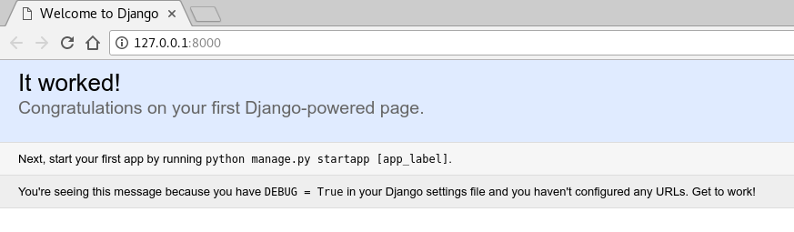
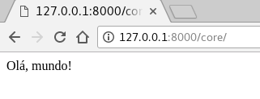
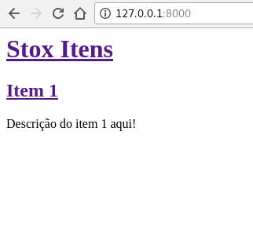
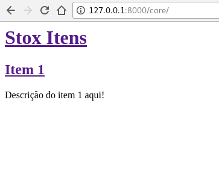
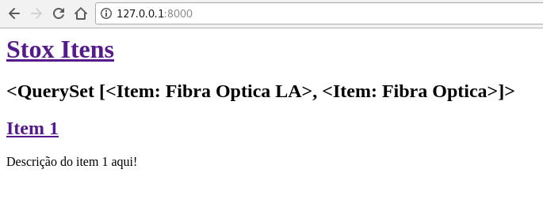
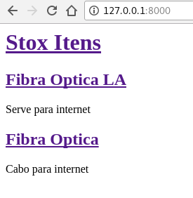

# INTRODUÇÃO AO DJANGO

## INSTALL DJANGO 

```bash
$ python --version
Python 3.6.2
$ pip install Django==1.11.6
$ python -m django --version
1.11.6
```

## START PROJECT

```bash
$ django-admin startproject stox
```

---

TREE

```bash
.
└── stox
    ├── manage.py
    └── stox
        ├── __init__.py
        ├── settings.py
        ├── urls.py
        └── wsgi.py
```

---

CD PROJECT

```bash
$ cd stox
```

## RUNSERVER

```bash
$ python manage.py runserver
```

```bash
Performing system checks...

System check identified no issues (0 silenced).

You have 13 unapplied migration(s). 
Your project may not work properly until you apply
the migrations for app(s): admin, auth, contenttypes,
sessions.
Run 'python manage.py migrate' to apply them.

October 14, 2017 - 19:27:29
Django version 1.11.6, using settings 'stox.settings'
Starting development server at http://127.0.0.1:8000/
Quit the server with CONTROL-C.
```

---

{width=400% height=400%}


## SETTING PORT

```bash
$ python manage.py runserver 8080
```

```bash
$ python manage.py runserver 0:8080
```

```bash
$ python manage.py runserver 0.0.0.0:8080
```

## STARTAPP

```bash
$ python manage.py startapp core
```

---

TREE

```bash
core
├── __init__.py
├── admin.py
├── apps.py
├── migrations
│   └── __init__.py
├── models.py
├── tests.py
└── views.py
```

---

core/views.py

```python
from django.http import HttpResponse

def index(request):
    return HttpResponse("Olá, mundo!")
```

---

core/urls.py

```python
from django.conf.urls import url

from . import views

urlpatterns = [
    url(r'^$', views.index, name='index'),
]
```

---

`<project>/urls.py`

stox/urls.py

```python
from django.conf.urls import include, url
from django.contrib import admin

urlpatterns = [
    url(r'^core/', include('core.urls')),
    url(r'^admin/', admin.site.urls),
]
```

---

{width=400% height=400%}

## DATABASES 

`<project>/settings.py`

```python
DATABASES = {
    'default': {
        'ENGINE': 'django.db.backends.sqlite3',
        'NAME': os.path.join(BASE_DIR, 'db.sqlite3'),
    }
}
```

---

> ENGINE

 - 'django.db.backends.sqlite3'
 - 'django.db.backends.postgresql'
 - 'django.db.backends.mysql'
 - 'django.db.backends.oracle'

---

> NAME 

O valor padrão os.path.join(BASE_DIR, 'db.sqlite3'),
irá criar este arquivo no diretório do seu projeto.

---

Caso não use o SQLite como banco de dados, configurações adicionais como USER, PASSWORD, e HOST deverão ser adicionadas. Para mais detalhes, veja a referência na documentação para DATABASES.


## SETTINGS

```python
LANGUAGE_CODE = 'pt-br'

TIME_ZONE = 'America/Recife'
```

---

> INSTALLED_APPS

- django.contrib.admin – O admin site.
- django.contrib.auth – Um sistema de autenticação.
- django.contrib.contenttypes – Um framework para tipos de conteúdo.
- django.contrib.sessions – Um framework de sessão.
- django.contrib.messages – Um framework de envio de mensagem.
- django.contrib.staticfiles – Um framework para gerenciamento de arquivos estáticos.

---

> BUILD APPS

```bash
$ python manage.py migrate
```

---

> Consulte db.sqlite3

`<raiz-project>`

```bash
$ sqlite3
sqlite> .open db.sqlite3
sqlite> .schema
CREATE TABLE IF NOT EXISTS "django_migrations" ("id" integer NOT NULL PRIMARY KEY AUTOINCREMENT, "app" varchar(255) NOT NULL, "name" varchar(255) NOT NULL, "applied" datetime NOT NULL);
CREATE TABLE sqlite_sequence(name,seq);
```

## CREATE MODELS

`core/models.py`

```python
from django.db import models


class Item(models.Model):
    item_text = models.CharField(max_length=100)
    descricao_text = models.CharField(max_length=500)
    pub_date = models.DateTimeField('data de publicação')


class Escolha(models.Model):
    item = models.ForeignKey(Item, on_delete=models.CASCADE)
    escolha_text = models.CharField(max_length=200)
    boolean = models.IntegerField(default=0)
```


---

`<project>/settings.py`

```python
INSTALLED_APPS = [
    'core.apps.CoreConfig',
    'django.contrib.admin',
    'django.contrib.auth',
    'django.contrib.contenttypes',
    'django.contrib.sessions',
    'django.contrib.messages',
    'django.contrib.staticfiles',
]
```

---

> Build Apps

```bash
$ python manage.py makemigrations core
```

Algo similar aparecerá

```bash
core/migrations/0001_initial.py
    - Create model Escolha
    - Create model Item
    - Add field item to escolha
```

---

> SQL 

```bash
python manage.py sqlmigrate core 0001
```

---

> Check

```bash
$ python manage.py check 
System check identified no issues (0 silenced).
```

---

> Todo Ok! execute

```bash
$ python manage.py migrate
```

---

> Atividade

- Mude seu modelo (em `models.py`).
- Rode `python manage.py makemigrations` para criar migrações para suas modificações
- Rode `python manage.py migrate` para aplicar suas modificações no banco de dados.

## SHELL DJANGO

```bash
$ python manage.py shell
```

---

```bash
>>> from core.models import Item, Escolha
>>> Item.objects.all()
<QuerySet []>
>>> from django.utils import timezone
>>> i = Item(item_text="Fibra Optica",
...          descricao_text="Serve para internet",
...          pub_date=timezone.now())   
>>> i
<Item: Item object>
>>> i.save()
>>> i.id
1
```

---

```bash
>>> i.item_text
'Fibra Optica'
>>> i.descricao_text
'Serve para internet'
>>> i.pub_date
datetime.datetime(2017, 10, 17,
...               2, 7, 42, 566605, 
...               tzinfo=<UTC>)
>>> i.item_text = "Fibra Optica LA"
>>> i.item_text
'Fibra Optica LA'
>>> i.save()
>>> Item.objects.all()
<QuerySet [<Item: Item object>]>
```

---

> Retorna a String e não o Object.

`core/models.py`

```python
from django.db import models
from django.utils.encoding import python_2_unicode_compatible

@python_2_unicode_compatible
class Item(models.Model):
    # ...
    def __str__(self):
        return self.item_text

@python_2_unicode_compatible
class Escolha(models.Model):
    # ...
    def __str__(self):
        return self.escolha_text
```

---

`core/models.py`

```python
import datetime

from django.db import models
from django.utils import timezone


class Item(models.Model):
    # ...
    def foi_adicionado_recentemente(self):
        return self.pub_date >= timezone.now() - datetime.timedelta(days=1)
```

---

> Voltamos a testar com Shell

```bash
$ python manage.py shell
```

---

```bash
>>> from core.models import Item, Escolha 
>>> Item.objects.all()
<QuerySet [<Item: Fibra Optica LA>]>
>>> Item.objects.filter(id=1)
<QuerySet [<Item: Fibra Optica LA>]>
>>> Item.objects.filter(item_text__startswith='Fibra')
<QuerySet [<Question: Fibra Optica LA>]>
>>> from django.utils import timezone
>>> current_year = timezone.now().year
>>> Item.objects.get(pub_date__year=current_year)
<Item: Fibra Optica LA>
```

---

```bash
>>> Item.objects.get(id=2)
Traceback (most recent call last):
    ...
DoesNotExist: Item matching query does not exist.
>>> Item.objects.get(pk=1)
<Item: Fibra Optica LA>
>>> i = Item.objects.get(pk=1)
>>> i.foi_adicionado_recentemente()
True
>>> i = Item.objects.get(pk=1)
>>> i.escolha_set.all()
<QuerySet []>
```

---

```bash
>>> i.escolha_set.create(escolha_text='Não tem', boolean=0)
<Escolha: Não tem>
>>> i.escolha_set.create(escolha_text='Tem item', boolean=1)
<Escolha: Tem item>
>>> i.escolha_set.all()
<QuerySet [<Escolha: Não tem>, <Escolha: Tem item>]>
>>> i.escolha_set.count()
2
```

----

```bash
>>> Escolha.objects.filter(item__pub_date__year=current_year)
<QuerySet [<Escolha: Não tem>, <Escolha: Tem item>]>
>>> d = i.escolha_set.filter(escolha_text__startswith='Tem')
>>> d.delete()
```

# CREATE SUPERUSER

## USER ADMIN

```python
$ python manage.py createsuperuser
Username: admin
Email address: admin@example.com
Password: **********
Password (again): *********
Superuser created successfully.
```

## RUNSERVER

```bash
$ python manage.py runserver
```

---

Link: [http://127.0.0.1:8000/admin](http://127.0.0.1:8000/admin)

## ADMIN

`core/admin.py`

```python
from django.contrib import admin

from .models import Item

admin.site.register(Item)
```

---

Link: [http://127.0.0.1:8000/admin](http://127.0.0.1:8000/admin)


# TEMPLATE

## GIT WEB-DJANGO   

```bash
$ git clone https://github.com/iuryxavier/aulas.git
```


## TREE 

```bash
$ cd core
$ tree
```

```bash
.
├── __init__.py
├── __pycache__
├── admin.py
├── apps.py
├── migrations
├── models.py
├── tests.py
├── urls.py
└── views.py
```

## CREATE TEMPLATE

```bash
$ mkdir templates
$ mkdir templates/core
$ touch templates/core/index.html
```

---

> templates/core/index.html

```html
<html>
    <head>
        <title>Stox</title>
    </head>
    <body>
        <div>
            <h1><a href="">Stox Itens</a></h1>
        </div>
        <div>
            <h2><a href=""> Item 1</a></h2>
            <p>Descrição do item 1 aqui!</p>
        </div>
    </body>
</html>
```

## VIEWS

> core/views.py

```python
from django.shortcuts import render

def index(request):
    template = 'core/index.html'
    context = {}

    return render(request, template, context)
```

## URLS  

> stox/urls.py

```python
from django.conf.urls import include, url
from django.contrib import admin

urlpatterns = [
    url(r'^', include('core.urls')),
    url(r'^core/', include('core.urls')),
    url(r'^admin/', admin.site.urls),
]
```

---

{width=50% height=50%}

---

{width=50% height=50%}

# TEMPLATE DINÂMICO

## VIEWS 

> core/views.py

```python
from django.shortcuts import render
from .models import Item


def index(request):
    itens = Item.objects.all()
    template = 'core/index.html'
    context = {'itens': itens}

    return render(request, template, context)
```

## TEMPLATE

> core/templates/core/index.html

```html
<body>
    <div>
        <h1><a href="">Stox Itens</a></h1>
    </div>
    <div>
        <h2>{{ itens }}</h2>
    </div>
    <div>
        <h2><a href=""> Item 1</a></h2>
        <p>Descrição do item 1 aqui!</p>
    </div>
</body>
```

---

{width=100% height=100%}

---

> templates/core/index.html
> Modifique o template

```html
<div>

    <h2>{{ item }}</h2>

</div>
```

---

## COMO FICOU?

## NEW TEMPLATE 

> templates/core/index.html

```html

<div>
    <h2><a href="">{{ item.item_text }}</a></h2>
    <p>{{ item.descricao_text }}</p>
</div>

```

---

> Adiciona linebreaksbr

```html

<div>
    <h2><a href="">{{ item.item_text }}</a></h2>
    <p>{{ item.descricao_text|linebreaksbr }}</p>
</div>

```

---

{width=50% height=50%}

---

# BASE TEMPLATE

## MAKER BASE

> templates/core

```bash
$ cp index.html base.html
```

---

> templates/core/base.html

```html

<html>
    <head>...</head>
    <body>
       <div>
            <h1>...</h1>
        </div> 
        
        
    </body>
```

---

> templates/core/index.html

```html



    
        <div>
            <h2><a href="">{{ item.item_text }}</a></h2>
            <p>{{ item.descricao_text|linebreaksbr }}</p>
        </div>
    

```

## COMO FICOU?

## DETAILS ITEM

> core/views.py 

```python
from django.shortcuts import render, get_object_or_404
...
```

```python
...
def item_detail(request, pk):
    item = get_object_or_404(Item, pk=pk)
    return render(request, 'core/item_detail.html', {'item': item})
```

---

> templates/core/item_detail.html

```html



    <h1>{{ item.item_text }}</h1>
    <p>{{ item.descricao_text|linebreaksbr }}</p>

```

---

> templates/core/index.html

```html



    
        <div>
            <h2>
                <a href="">
                ...
                </a>
            </h2>
            ...
        </div>
    

```

---

```python
from django.conf.urls import url

from . import views

urlpatterns = [
    url(r'^$', views.index, name='index'),
    url(r'^item/(?P<pk>[0-9]+)/$',
        views.item_detail,
        name='item_detail'),
]
```

# STOX HOMEPAGE

---

Entre em aulas/web-django/extra/shop-homepage/
veja o index.html em seu browser e depois
em aulas/web-django/extra/shop-item/
e veja o index.html em seu browser e depois
copie os arquivos para templates/core/

# Reference

---

> referências

* [django 1.11 templates](https://docs.djangoproject.com/en/1.11/ref/templates/)
* [jinja2](http://jinja.pocoo.org/docs/2.9/)

# Configuração/Automação do Ambiente para Deploy

## Heroku

---

> [https://www.heroku.com](https://www.heroku.com)

---

Cadastro

---

## Deploy

---

# Envio de e-mails

# Migração de Dados (django migrations)

