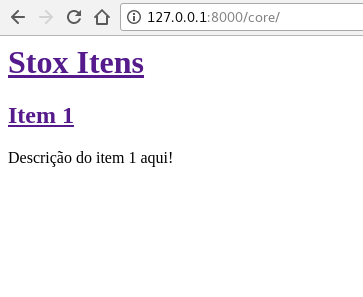
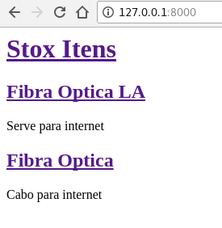

# TEMPLATE

## GIT WEB-DJANGO   

```bash
$ git clone https://github.com/iuryxavier/aulas.git
```


## TREE 

```bash
$ cd core
$ tree
```

```bash
.
├── __init__.py
├── __pycache__
├── admin.py
├── apps.py
├── migrations
├── models.py
├── tests.py
├── urls.py
└── views.py
```

## CREATE TEMPLATE

```bash
$ mkdir templates
$ mkdir templates/core
$ touch templates/core/index.html
```

---

> templates/core/index.html

```html
<html>
    <head>
        <title>Stox</title>
    </head>
    <body>
        <div>
            <h1><a href="">Stox Itens</a></h1>
        </div>
        <div>
            <h2><a href=""> Item 1</a></h2>
            <p>Descrição do item 1 aqui!</p>
        </div>
    </body>
</html>
```

## VIEWS

> core/views.py

```python
from django.shortcuts import render

def index(request):
    template = 'core/index.html'
    context = {}

    return render(request, template, context)
```

## URLS  

> stox/urls.py

```python
from django.conf.urls import include, url
from django.contrib import admin

urlpatterns = [
    url(r'^', include('core.urls')),
    url(r'^core/', include('core.urls')),
    url(r'^admin/', admin.site.urls),
]
```

---

{width=50% height=50%}

---

{width=50% height=50%}

# TEMPLATE DINÂMICO

## VIEWS 

> core/views.py

```python
from django.shortcuts import render
from .models import Item


def index(request):
    itens = Item.objects.all()
    template = 'core/index.html'
    context = {'itens': itens}

    return render(request, template, context)
```

## TEMPLATE

> core/templates/core/index.html

```html
<body>
    <div>
        <h1><a href="">Stox Itens</a></h1>
    </div>
    <div>
        <h2>{{ itens }}</h2>
    </div>
    <div>
        <h2><a href=""> Item 1</a></h2>
        <p>Descrição do item 1 aqui!</p>
    </div>
</body>
```

---

{width=100% height=100%}

---

> templates/core/index.html
> Modifique o template

```html
<div>

    <h2>{{ item }}</h2>

</div>
```

---

## COMO FICOU?

## NEW TEMPLATE 

> templates/core/index.html

```html

<div>
    <h2><a href="">{{ item.item_text }}</a></h2>
    <p>{{ item.descricao_text }}</p>
</div>

```

---

> Adiciona linebreaksbr

```html

<div>
    <h2><a href="">{{ item.item_text }}</a></h2>
    <p>{{ item.descricao_text|linebreaksbr }}</p>
</div>

```

---

{width=50% height=50%}

---

# BASE TEMPLATE

## MAKER BASE

> templates/core

```bash
$ cp index.html base.html
```

---

> templates/core/base.html

```html

<html>
    <head>...</head>
    <body>
       <div>
            <h1>...</h1>
        </div> 
        
        
    </body>
```

---

> templates/core/index.html

```html



    
        <div>
            <h2><a href="">{{ item.item_text }}</a></h2>
            <p>{{ item.descricao_text|linebreaksbr }}</p>
        </div>
    

```

## COMO FICOU?

## DETAILS ITEM

> core/views.py 

```python
from django.shortcuts import render, get_object_or_404
...
```

```python
...
def item_detail(request, pk):
    item = get_object_or_404(Item, pk=pk)
    return render(request, 'core/item_detail.html', {'item': item})
```

---

> templates/core/item_detail.html

```html



    <h1>{{ item.item_text }}</h1>
    <p>{{ item.descricao_text|linebreaksbr }}</p>

```

---

> templates/core/index.html

```html



    
        <div>
            <h2>
                <a href="">
                ...
                </a>
            </h2>
            ...
        </div>
    

```

---

```python
from django.conf.urls import url

from . import views

urlpatterns = [
    url(r'^$', views.index, name='index'),
    url(r'^item/(?P<pk>[0-9]+)/$',
        views.item_detail,
        name='item_detail'),
]
```

# STOX HOMEPAGE

---

Entre em aulas/web-django/extra/shop-homepage/
veja o index.html em seu browser e depois
em aulas/web-django/extra/shop-item/
e veja o index.html em seu browser e depois
copie os arquivos para templates/core/

# Reference

---

> referências

* [django 1.11 templates](https://docs.djangoproject.com/en/1.11/ref/templates/)
* [jinja2](http://jinja.pocoo.org/docs/2.9/)

